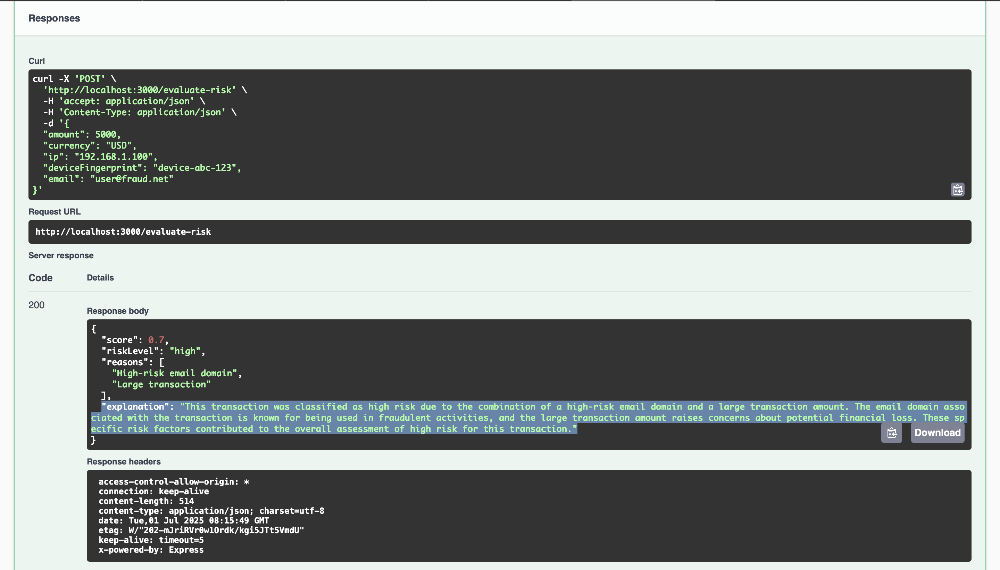
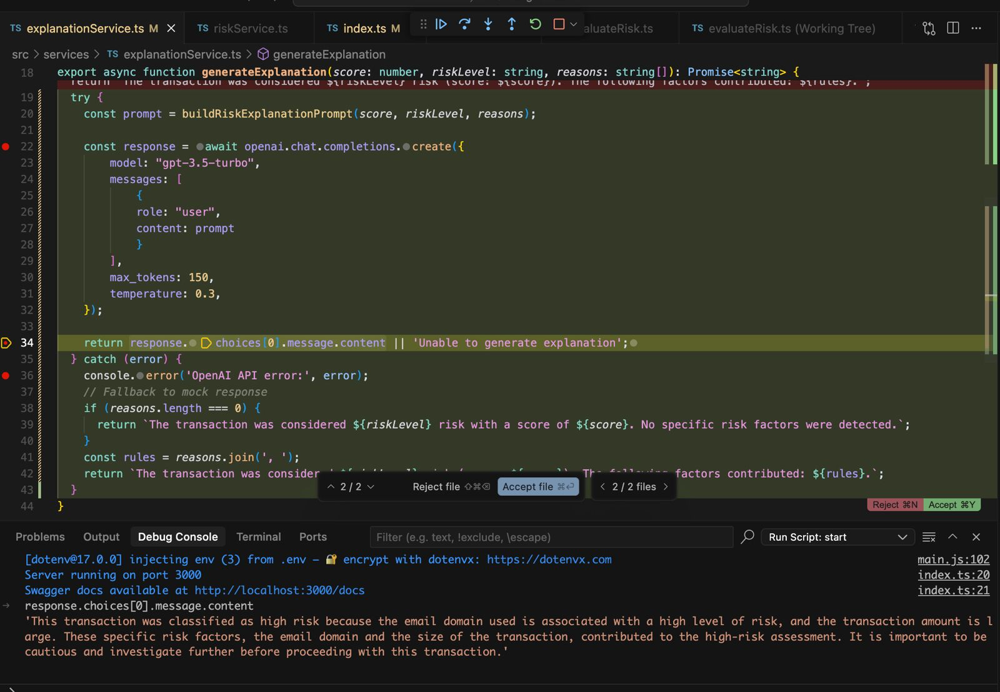

# Risk-Engine-LLM

Risk-Engine-LLM is an AI-powered microservice that evaluates fraud risk for payment transactions using rule-based heuristics. It simulates a real-world fraud scoring engine focused on explainability and modularity. Built with Node.js, TypeScript, and Express, it uses LLMs to generate human-readable risk explanations.

---

## 📁 Project Structure


```
src/
├── index.ts                  # Main Express app entry point
├── routes/
│   └── evaluateRisk.ts       # Route handler for /evaluate-risk
├── services/
│   ├── riskService.ts        # Risk evaluation logic
│   └── explanationService.ts # LLM-based explanation generator
├── rules/
│   └── heuristics.ts         # Fraud detection heuristics
├── utils/
│   ├── ipDeviceTracker.ts    # In-memory IP/device tracking
│   ├── promptBuilder.ts      # Builds prompts for LLM
│   └── swagger.ts            # Swagger JSDoc config
├── __tests__/
│   ├── riskService.test.ts   # Unit tests for riskService
│   ├── heuristics.test.ts    # Unit tests for heuristics
│   └── ipDeviceTracker.test.ts # Unit tests for IP/device tracker
```

- **index.ts**: Sets up Express, middleware, routes, and Swagger UI.
- **routes/evaluateRisk.ts**: Handles POST /evaluate-risk, validates input, and returns risk assessment with LLM explanation.
- **services/riskService.ts**: Aggregates fraud rules and tracking to compute risk score and level.
- **services/explanationService.ts**: Calls OpenAI (or mock) to generate a human-readable explanation for the risk assessment.
- **rules/heuristics.ts**: Contains individual fraud detection rules (e.g., high-risk email, large transaction).
- **utils/ipDeviceTracker.ts**: Tracks repeat IPs/devices and scores them for risk.
- **utils/promptBuilder.ts**: Dynamically builds prompts for the LLM based on risk data.
- **utils/swagger.ts**: Modular Swagger JSDoc config for API docs.
- **__tests__/**: Jest unit tests for core business logic and edge cases.

See below for more details on testing, Docker, and API usage.

---

## 📚 API Documentation

The API is documented using Swagger UI and is available at:

```bash
http://localhost:3000/docs

```

## 🚀 Getting Started

Install dependencies:

```bash
npm install

```

## Project Structure Explanation

**src/index.ts**
- Entry point for the Express server. Sets up middleware and mounts the `/evaluate-risk` endpoint.

**src/routes/evaluateRisk.ts**
- Defines the POST `/evaluate-risk` endpoint. Validates input and delegates risk evaluation to the service layer.

**src/services/riskService.ts**
- Contains the main logic for evaluating payment risk. Aggregates results from various heuristics and utilities to produce a risk score and level.

**src/rules/heuristics.ts**
- Implements individual fraud detection rules, such as checking for high-risk email domains and large transactions.

**src/utils/ipDeviceTracker.ts**
- Provides in-memory tracking for IP addresses and device fingerprints to help identify repeat usage patterns that may indicate fraud.

---

## 🧭 Development Progress

→ Created folder Risk-Engine-LLM
→ Generated Express + TypeScript boilerplate with /evaluate-risk route (Cursor)
→ Implementd fraud scoring logic (Cursor)
→ Tested locally using sample input with Swagger document
→ Added LLM explanation generator (Cursor)
→ Added .env support for OPENAI_API_KEY
→ Integrated OPENAI Chat completion API using model: 'gpt-3.5-turbo'
→ Added Unit Tests
→ Added Docker Support

---

## 🧪 Testing

### Run Tests
```bash
# Run all tests
npm test

# Run tests in watch mode
npm run test:watch

# Run tests with coverage
npm run test:coverage
```

### Test Coverage
The test suite covers:
- Risk evaluation logic with various scenarios
- Fraud detection heuristics (email domains, transaction amounts)
- IP and device fingerprint tracking
- Edge cases and error conditions

---

## 🐳 Docker Support

### Build and Run with Docker
```bash
# Build the Docker image
docker build -t risk-engine .

# Run the container
docker run -p 3000:3000 --env-file .env risk-engine
```

### Using Docker Compose
```bash
# Start the service
docker-compose up -d

# View logs
docker-compose logs -f

# Stop the service
docker-compose down
```

### Environment Variables
Create a `.env` file in the root directory:
```bash
OPENAI_API_KEY=your_openai_api_key_here
OPENAI_ORG_ID=your_org_id_here
OPENAI_PROJECT_ID=your_project_id_here
```

---

## 📚 API Documentation

Visit `http://localhost:3000/docs` for interactive API documentation powered by Swagger UI.

---

## Swagger UI (Sample)

Here's a preview of the live API documentation served via Swagger UI:



> Screenshot: Live `/evaluate-risk` endpoint with sample request schema and responses

---

## Debugging

Here's a preview of the Debugger:



> Screenshot: Debugging `src/explanationService.ts` getting Successful response from OpenAI Chat Completion API

---

## 🔒 License

This project is proprietary and confidential. Unauthorized use or distribution is strictly prohibited.  
For licensing requests, contact **Ankit Maheshwari**.

---

